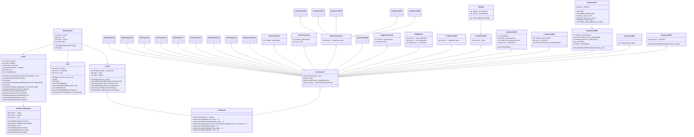

```mermaid
classDiagram
    class NanoTekSpice {
        +void addCircuit(const std::string)
        +void loop()

        -nts::Parser _parser
        -std::size_t _tick
        -std::vector<nts::Circuit> _circuits
        -nts::Shell _shell
    }

    NanoTekSpice --> Parser
    Parser --> IComponentContainer

    NanoTekSpice --> Shell
    NanoTekSpice --> Circuit

    Circuit <|-- IComponent
    AComponent <|-- IComponent

    AndComponent <|-- AComponent
    NandComponent <|-- AComponent
    OrComponent <|-- AComponent
    NorComponent <|-- AComponent
    NotComponent <|-- AComponent
    TrueComponent <|-- AComponent
    FalseComponent <|-- AComponent
    XorComponent <|-- AComponent
    OutputComponent <|-- AComponent
    InputComponent <|-- AComponent
    ClockComponent <|-- AComponent
    AGatesComponent <|-- AComponent
    Component4069 <|-- AComponent
    LoggerComponent <|-- AComponent

    FullBitAdder <|-- AComponent
    Component4008 <|-- AComponent
    Component4013 <|-- AComponent
    FlipFlop --> Component4013
    Component4017 <|-- AComponent
    Component4040 <|-- AComponent
    Component4094 <|-- AComponent
    ShiftContainer --> Component4094
    Component4512 <|-- AComponent
    Component4514 <|-- AComponent

    Component4001 <|-- AGatesComponent
    Component4011 <|-- AGatesComponent
    Component4030 <|-- AGatesComponent
    Component4071 <|-- AGatesComponent
    Component4081 <|-- AGatesComponent

    class Parser {
        +nts::Parser::IComponentContainer getContainer() const
        +void setFileName(const std::string)
        +void parse()

        -nts::Factory _factory
        -std::string _fileName
        -std::ifstream _fileStream
        -IComponentContainer _container
        -std::string _line
        -bool _lineIsStatement

        -std::optional<std::shared_ptr<nts::IComponent>> findComponentByName(const std::string &name)
        -bool open()
        -void parseSection(std::stringstream &, const std::string)
        -void parseChipsetLine(const std::string &)
        -std::pair<std::size_t, std::shared_ptr<nts::IComponent>> parseLinkPart(std::string &)
        -void parseLinkLine(const std::string &)
        -std::string &getline(std::stringstream &ss)
        -void removeComments(std::string &)
        -void removeWhitespaces(std::string &)
    }

    class IComponentContainer {
        +void addToCircuit(nts::Circuit &)
        +std::optional<std::shared_ptr<nts::IComponent>> find(const std::string &)
        +bool empty() const
        +void addInput(std::pair<std::string, std::shared_ptr<IComponent>> &pair)
        +void addOutput(std::pair<std::string, std::shared_ptr<IComponent>> &pair)
        +void addRest(std::pair<std::string, std::shared_ptr<IComponent>> &pair)

        -std::vector<std::pair<std::string, std::shared_ptr<nts::IComponent>>> _inputs
        -std::vector<std::pair<std::string, std::shared_ptr<nts::IComponent>>> _outputs
        -std::vector<std::pair<std::string, std::shared_ptr<nts::IComponent>>> _rest
    }

    class Shell {
        +Shell(std::vector<nts::Circuit> &, std::size_t &)
        +~Shell()
        +void loop()

        -std::vector<nts::Circuit> &_circuits
        -std::size_t _circuitIndex
        -std::size_t &_tick

        -void commandDisplay()
        -void commandSimulate(bool add = true)
        -void commandLoop()
        -void commandInputValue(std::string &)
        -std::optional<nts::Tristate> strToTristate(const std::string &str)
    }

    class IComponent {
        +virtual ~IComponent() = default
        +virtual void simulate(std::size_t tick) = 0
        +virtual nts::Tristate compute(std::size_t pin) = 0
        +virtual void setLink(std::size_t pin, nts::IComponent &other, std::size_t otherPin) = 0
        +virtual void setState(Tristate state) = 0
        +virtual void setInternalState(Tristate state) = 0
        +virtual nts::Tristate getState() const = 0
    }

    class Circuit {
        +void display(std::size_t &tick)
        +void addComponent(std::string, std::shared_ptr<IComponent>)
        +void addInput(std::string, std::shared_ptr<IComponent>)
        +void addOutput(std::string, std::shared_ptr<IComponent>)
        +std::shared_ptr<IComponent> find(const std::string &)
        +std::shared_ptr<IComponent> findInput(const std::string &)

        -std::unordered_map<std::string, std::shared_ptr<IComponent>> _components
        -std::map<std::string, std::shared_ptr<IComponent>> _inputs
        -std::map<std::string, std::shared_ptr<IComponent>> _outputs
    }

    class AComponent {
        #std::unordered_map<std::size_t, std::pair<IComponent &, std::size_t>> _pins
        #Tristate _state
        #std::unordered_map<std::size_t, std::size_t> _computedAmount

        -const std::size_t _maxComputedLoopAmount
    }

    class AndComponent
    class NandComponent
    class OrComponent
    class NorComponent
    class NotComponent
    class TrueComponent
    class FalseComponent
    class XorComponent
    class OutputComponent

    class InputComponent {
        -nts::Tristate _internalState
    }
    class ClockComponent {
        -nts::Tristate _internalState
        -std::size_t _tick
    }

    class AGatesComponent {
        -std::array<std::unique_ptr<T>, 4> _component_array
    }

    class Component4001
    class Component4011
    class Component4030
    class Component4069
    class Component4071
    class Component4081

    class LoggerComponent {
        -nts::Tristate _previousClock
        -std::ofstream _file
    }

    class FullBitAdder {
        -std::array<std::shared_ptr<nts::AndComponent>, 2> _and_components
        -std::array<std::shared_ptr<nts::XorComponent>, 2> _xor_components
        -std::unique_ptr<nts::OrComponent> _or_component
    }

    class FlipFlop {
        -nts::Tristate _previousClock
        -nts::Tristate _reversedState
        -nts::Tristate getReverseState()
    }

    class Component4008 {
        -std::array<std::unique_ptr<nts::FullBitAdder>, 4> _component_array
    }

    class Component4013 {
        -std::array<std::unique_ptr<nts::FlipFlop>, 2> _array
    }

    class Component4017 {
        -void increaseIndex()
        -int _currentIndex
        -nts::Tristate _previousClock
        -nts::Tristate _previousInverseClock
        -std::array<std::pair<std::size_t, int>, 10> _outputArray
    }

    class Component4040 {
        -nts::Tristate _previousClock
        -std::size_t _clockCycle
        -const std::unordered_map<std::size_t, std::size_t> _pinToIndexMap
    }

    class Component4094 {
        -nts::Tristate _previousClock;
        -const std::unordered_map<std::size_t, std::size_t> _pinOutputMap;
        -nts::ShiftContainer<8> _shiftContainer;
        -bool _hasShifted;
        -std::array<nts::Tristate, 2> _serialOutputs;
        -void setStateFromShiftContainer(std::size_t pin);
    }

    class Component4512 {
        -nts::Tristate decide_state()
    }

    class Component4514 {
        -std::array<std::pair<std::size_t, uint8_t>, 16> _outputPins
        -std::optional<uint8_t> defineBinaryVal(std::array<std::pair<nts::Tristate, std::uint8_t>, 4> &vals)
    }

    class ShiftContainer {
        +void shift()
        +void add(nts::Tristate state)
        +std::size_t size() const
        +std::size_t max_size() const
        +void fill(nts::Tristate state)
        +nts::Tristate &operator[](std::size_t index)
        -std::array<nts::Tristate, T> _container
    }
```
